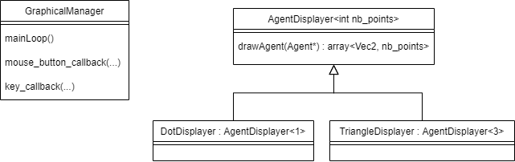

## III. Code Logic and Architecture
## Class Vec2

This class is the foundation class used in all other classes. It manages the calculation of 2-D vectors.
It is used mainly to store coordinates of points.
We tried to override a maximum of operator methods to manipulate the class easier.

### Main methods
- Operator `+, -, *, /` are override
- Operator `<<` is override to display easier
- scalar product
- get norm
- normalize vector
- get angle between current vector and X axis
- get angle between two vectors
- rotate given an angle


## Functions in utils

All following functions are presented in different parts of the project.

- `distance` it calculates the distance between two `Vec2`
- `barycenter` it calculates the barycenter given a set of `Vec2`
- `radians` it converts a degrees angle into radians angle
- `degrees` it converts a radians angle into degrees angle
- `isAntiClockwise` it allows to know if two `Vec2` are anti clockwise
- `randomVec2Generation` it generates a random `Vec2`
- `random_float` it generates a random float

<!-- Todo Add new functions -->

## Main classes


<!-- Todo Change diagram -->

### Flock

The flock constitutes the ensemble of the environment, agents and interactions simulated by the program, in a way that only one flock can be generated and displayed to the user.

In technical terms, the flock is represented by a class, the highest class in the code hierarchy whose instantiated object will incorporate most of the other objects in the project. It hosts, for example, all of the birds and predators in the project.
The only attribute of this class is a vector of pointers to *Agents*. An Agent can be interpreted as a living being belonging to the flock, such as a bird or an eagle, which will interact with other agents around him. Thus, this vector points to the data representing the actual flock.

This vector can be modified according to agents or user interaction by the methods of the class Flock. Therefore, the vector (representing the flock) can grow, when an agent is added, or can decrease in size, when an agent is removed. It methods also permits to access information of the flock, such as its size or specific agent.

### Agent

As already stated, an agent is an active member, a living being of the flock. It is represented in the code by a class that, when instantiated, will create the objects belonging to the Flock vector.
In practice, though, this class can never be instantiated, as it intends only to be a parent class for two other child classes: `Bird` and `Eagle`.

Which instantiated objects will then inherite or override the general properties and methods of an agent.
The agent, for example, has a position and velocity representing the values perceived by the user in the last time step. In order to compute the interactions between the agents and the user in the current time step, another position and velocity are also stored, according to its own speed limit. Other properties related to the interface are body size and color.

The interaction between agents occurs only if they are within a certain range and view angle (according to its own movement direction). All this properties can be different pursuant to the agent type - eagle or bird (and even type of bird). In addition, each child class has its own specific attributes and methods to determine its behaviour.
The attributes in the Agent class, are all *protected*, thus they can only be accessed from its own methods or from their child classes, but not from outside. In the last case, interface methods are provided to access and set such properties.

### Bird

The objects of this class will represent, intuitively, the birds of a flock. The instantiation of a Bird is done by a constructor which will simply call the *Agent constructor* with certain specific values. The position and velocity, for example, are randomly chosen within certain boundaries, whereas the size, range and view angle (270°) are set to constant values.
The bird's behaviour, on the other hand, is determined by a group of rules/laws represented and computed by private methods:

* Cohesion law
* Separation law
* Fleeing law
* Alignment law

Each of these will contribute to modify the computed speed of the bird, and therefore its position and direction of movement.

### Bird's Laws

#### Cohesion law
The cohesion law is the law responsible for the agents trying to move closer to their viable neighbors, as such a Bird will try to get closer to the Birds found in its field of vision.
In practice, this law computes a barycenter for all the viable neighbors who are in the visible range of a Bird and not in its vital avoidance cell. The displacement, which is the difference between the actual velocity of an agent and its next velocity, of this Bird will then be modified to enable reaching the location of this barycenter, more or less quickly depending on the relaxation of this law.

#### Separation law
The separation law is the law responsible for the agents not clustering on top of each others.
This effect is obtained using the inverse of the square distance between two agents as a weight, meaning that in practice closer two birds become the more the separation will be strong, up to a degree where it can virtually negate the effects of the other laws.
In practice, this law adds a component to the displacement of an agent representing the weighted sum of the movements created in the opposite direction of each chosen neighbors.
This law is used two times during a Bird displacement calculation, one with it's Birds neighbors, and one with it's Eagles neighbors using a higher weight to represent an attempt to "escape" (previously mentionned as fleeing law).

#### Alignment law
The alignement law is the law responsible for the tendency of the agents of a cluster, created by the effects of the two preceding laws, to obtain a common facing direction with their neighbors found in their respective fields of vision.
In practice, this law adds a component to the displacement of an agent representing a mean between the actual velocity of its viable neighbors.

### Eagle
The objects of this class will, intuitively, represent eagles. Eagles are predators, and their role in the flock is to chase birds and eat them.
Similar to the class Bird, this one also calls the *Agent constructor*, although with different parameters like a smaller size and range, different color and narrower view angle.
The behaviour of an eagle is also different from a bird, and it is determined by only one law:

*  Hunting law

As in *Birds*, these laws will be computed and modify the position and velocity of the eagle.

### Eagle's Law

#### Hunting law
This law is responsible for the predator chasing the birds. If there are bids in the eagle's view angle and range, a random prey is chosen to be the focus of the chase at each time step. This means that the predator's velocity will scale according to the prey's velocity - that is, the eagle will intersect the bird at its next position.
If the eagle gets close enough to its prey, it will *feed* from it; In programming terms, the object *Bird* will be destroyed from memory and the removed from the Flock vector, also disappearing from the graphical user interface. After feeding, the eagle grows in size, until a certain limit; overcoming this limit, the predator will divide itself - that is, return to its original size and create 2 other predators in the same position.


### Laws
The previously cited laws are children classes of a virtual parent class Law.
Those laws are the core of the design of this program, and represent most of its need for computing ressources when associated with the calculation of the neighbors needed to get the effects of a law on an agent.
In technical terms, the Law class includes in particular a protected relaxation variable which represents how smooth an agent will react to a given law, a protected law constructor which is used for the instantiation of its children classes, and a public method named compute which is overriden by each children laws in order to modify the next velocity value of an agent.
Having considered that, it is important to notice the interactions between the laws and not a law by itself, and in particular the complementary laws affecting a Bird.
The weighted outputs of these laws form, after theirs respectives relaxation are applied, the displacement, which is a change in velocity enabling Birds to form clusters and Eagles to track their prey.

### Compute neighbors
In order to be able to calculate the laws of alignment, cohesion and separation, it was necessary to create the method "compute neighbors".
This method consists in going through a list of agents and checking the existence of a neighbor according to a precise range and to the angle of view of the agent (according to type of bird).


### Original idea
There were different algorithms which were tested to try to reduce the time for looking for neighbors of a particular agent.

The first idea was to implement a _brute-force_ function. We keeped it during the project to guarantee that we could find all neighbors for each iteration of a agent.

This algorithm has a complexity of `O(n²)`.


### Flock generator and color
There are differents level of personalization of Flocks generating according to the choice of the user :
This code contributes to generate different types of Birds in a Flock (Duck, Ant, Dove, Parrot,...),
with differents attributes (flock_size, range, angle_view, agent_size, cohesion_relax, sep_relax, align_relax, speed_relax, position, velocity, agent_color).
The color of the birds can be chosen to be random.

# User configuration
Now that we have implemented a flock generator, which can be used in many ways in the code, we want to be able to let the user configure his flock. This can be done by using options (c.f. chapter **Running the program - Options**).
To implement this, we used ```argc``` and ```argv[]``` parameter of the ```main``` function.

The order of the options are specific, and a different code is triggered depending on the number of arguments the user gave.

These options are thought to be user-friendly, which means that the user will be informed if he/she entered a wrong number of arguments, of a weird number (e.g. a size of flock of 0). The program will either warn the user if he/she is fully configurating the flock (with all options possible), or it will throw an exception if the user wants to use the _easy_ options (0, 1, or 2 arguments).

```
WARNING : Your flock's size will be 0, check your arguments.
WARNING : Color unknown, default color will be applied.
WARNING : Agent's size will be 0, check your arguments.
WARNING : Agent's range of view will be 0, check your arguments.
WARNING : Agent's angle view will be 0, check your arguments.
WARNING : Agent's max speed (int) will be 0, they won't move, check your arguments.
```

To be the most user friendly possible, we created some birds template, with given values for eveything (range and angle of view, size, color, laws' relaxations) so the user can try the program without knowing about the _complex_ options like laws' relaxations.

If the user uses the most complex generation of flock, he/she will be informed on the flock, to be able to adjust new parameters easily.

```
Generating a flock with
		100 blue agents
		range : 50 / angle
		view : 270
		max speed : 10

		>> Alignment : 0.5
		>> Separation : 0.002
		>> Cohesion : 0.03
```

These options could have been managed in a easier way using the C++ library `options`, allowing the user to mark the option he/she wanted with a dash `-`. This will be integrated next release.


## Graphical Manager
The goal of the GraphicalManager class is to wrap-up all the OpenGL components of the code to make development easier.
The GraphicalManager constructor initializes and manages OpenGL variables and our graphical variables to help us draw the shapes we want.

Some of the tasks it is assigned are :
- Creating the window
- Setting up the shaders programs
- Activating the shaders programs
- Creating the OpenGL buffers
- Initializing and defines variables needed to draw our shapes
- Linking our key and mouse callback functions with OpenGL event management
- Setting up the colors

This class also implements a method called "mainLoop" that, when called, executes one loop. Namely, it launches the calculations of the next positions of the Agents making them move and then proceeds to draw them. </br>
It's possible to draw the agents either as triangles or as points, even though at small number of agents it does not affect performance. We created a class "AgentDisplayer", called by GraphicalManager, implementing DotDisplayer and TriangleDisplayer to take care of the correct display conditionally.



It supports the display in windowed screen or fullscreen, and the Agent drawing as triangles or points.

Finally, the GraphicalManager destructor takes care of closing the window and cleaning the OpenGL variables before ending the program.

## FPS
FPS calculates the time needed to create an image and calculates the number of images created per second.
```cpp
		auto start = high_resolution_clock::now();
```
```cpp
		auto stop = high_resolution_clock::now();
		auto duration = duration_cast<microseconds>(stop - start);
		std::ostringstream oss;
		oss << 1 / (duration.count() * 10e-7) << " FPS. " << std::endl;
		glfwSetWindowTitle(m_window, oss.str().c_str());
```
