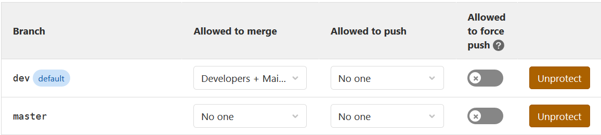

# IV.   Continuous integration

## Git management

It is not trivial to work in a team of seven people. At first, there we had no particular git management, the rule was to make a merge request on master when we felt our changes was good (compiles and runs on MSVC). Due to some accidental pushes on master, making the master branch not compilable, we started to think of a way to manage our git branches.
The idea was to make a new branch `dev`, in which no one is allowed to push, one can only update it using merge requests. This `dev` branch is our main development branch, while the `master` branch is blocked both for pushing **and** merging.

The `master` branch is unlocked when we have a stable version of the program, that we know can be delivered. In such a case, we allow `master` to be merged, and when it is, we re-block it again. This both separates our final product, and our development product on two different branches, but it also covers us against accidental pushes on a branch that compiles and runs.

Although this git management was way better than what we did at the beggining of the project, we were only building and testing our program on one compiler, MSVC. And all this had to be done by hand. The next thing we needed was to integrate continuous integration to our project.

## CI Pipeline

Now that we have a nice branch management, and a good merge request system, the only thing missing is a good pipeline which gets triggered for every push and merge request.

We started by using the Docker image `conanio/gcc9` so conan and gcc are both included and we don't have to start an image from scratch.
Some external packages are needed to compile and run our program : `libgtk2.0-dev` and `libgl1-mesa-dev`. The installation of these files take a few minutes (about 5). Since the docker image is cleared at the beginning of a new pipeline, we had to make these installation everytime. Since a new pipeline is created for **every pull**, which means that the developper has to wait **5 minutes** everytime he/she pushes. Better not miss a semi-colon ! We will develop what actions we decided to take in order to palliate this issue.

Now, when a developer pushes his/her branch, the new pipeline is triggered, the code is compiled on both GCC9 and Clang10 compilers, and tests are run on both these environments. In a merge request process, if the pipeline has not succeeded, the request is blocked until someone pushes a commit to fix the issue. This workflow allows us to continuously keep a clean code, which is portable on 3 different compilers.
All of this experience has shown us that some compilers do work that other won”t do, in which case we have to make this work explicit it in the code (most often is include problems, MSVC will automatically include some files and library needed for the project, which Clang won’t do).

## Docker

In order to run the builds in Continuous Integration Pipelines, docker images are needed in order to execute the commands of the pipeline. Namely the different stages needed are :
- The installation of the dependencies with conan
- The building job with various compilers
- Executing the tests

The first continuous integration pipelines were really time-consuming because it included downloading all the packages with conan commands. With the introduction of the _Clang_ compiler, some of the dependencies weren't directly downloadable via conan. These packages needed to be downloaded as source code, and then built from source. This stage of building from source the missing packages is extremely long (around 20 minutes) and it wasn't possible to wait this long at each pipeline.

We decided to build new docker images, with prebuilt and installed dependencies for both compilers _GCC_ and _Clang_. Two images were build from _conanio/gcc9_ and _conanio/clang10_ with our files.

It enabled us to iterate faster on our portability with other compilers.

[Next]("./profiling_performance_computing.md")

[Previous]("./code_logic_architecture.md")
