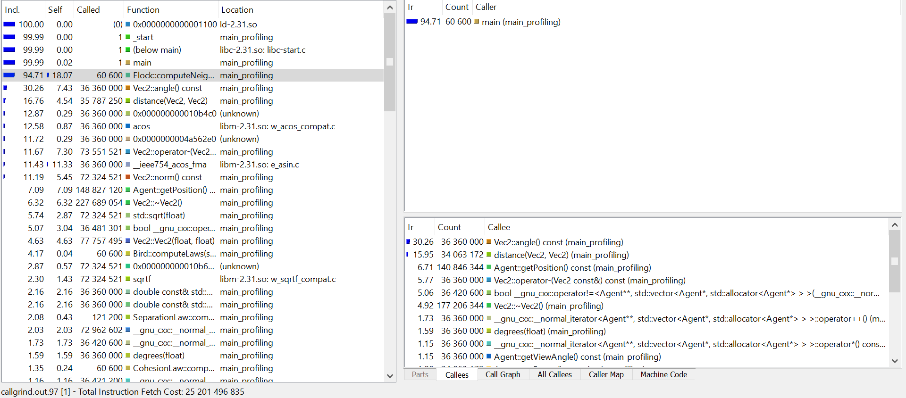
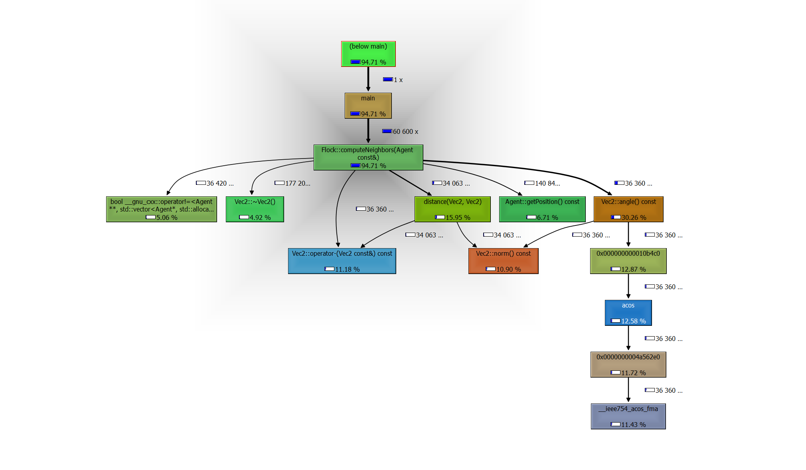

# V. Profiling and performance computing

## Notes before explanations

Profiling results were obtained on old version of the implementation of `computeNeighbors`.

## Valgrind

In order to improve the performances of the program, it is necessary to discover the sections of code that use the most resources. Valgrind is a Linux tool designed to help programmers analyze their code at runtime to get these precious informations.
Valgrind simulates every single instruction the program executes. Because of this, the active tool checks, or profiles, not only the code in the application but also in all supporting dynamically-linked libraries, including the C libraries, and so on.
 It is used with the built executables, called with valgrind commands. For example, the command we used was :
 `valgrind --tool=callgrind ./main_profiling`
 This command is slow, because the tool analyzes the code at runtime, and produces at the end a `callgrind.out` file containing thousands of text lines. It is nearly impossible to read it, so we use a graphical interface in which the information is much clearer.

We can see in the left pannel the different functions or methods called in our program, with their share of instruction fetch in blue relatively with other functions and methods. We can also see different informations, such as the % of self instruction fetch, excluding those of the callees, the number of times it has been called...

The right pannel contains more detailed informations about the function we selected in the left panel.

For example, as we can see in the image, there is all the functions that `Flock::computeNeighbors ` called. We see that 30% of the processors instructions fetch is used to calculate the angle of our vectors `Vec2`.

Another view of this type of information is the `Call Graph` of which we can see an example below :

We can easily and rapidly see who called who, and what are the share of resources each callee uses.
These informations were used to perform some minor optimisations in term of copies/references. However, the test and development iteration process of this methode is slow because we have to re-build on Linux, re-run valgrind at each development. It is also difficult to see wether the change did or did not have an impact on program performance, because the weights of the instruction fetches are relative and not absolute.

Even though we knew `Flock::computeNeighbors` was the function using most of the resources, we have not managed to reduce significantly the computational cost of this method. It was difficult to pinpoint where to reduce cost in, for example, `getPosition`, `angle`, `distance` etc.

We tried to implement the move constructor and move operator but it did not seem to have an impact on performance.

After taking a step back, we can determine some parts to improve and limits.

<a href="./conclusion_openings.md">Next</a>

<a href="./continuous_integration.md">Previous</a>
